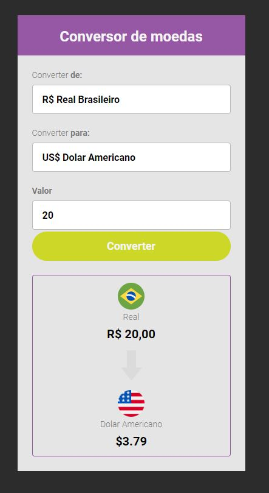

# conversor-de-moedas

> Resultado do projeto conversor de moedas.

### Ajustes e melhorias

O projeto ainda está em desenvolvimento e as próximas atualizações serão voltadas nas seguintes tarefas:

- [x] HTML
- [x] CSS
- [x] JavaScript
- [ ] atualização do Layout
## 🤝 Colaboradores

Agradecemos às seguintes pessoas que contribuíram para este projeto:

<table>
  <tr>
    <td align="center">
      <a href="#">
      <a href="https://www.linkedin.com/in/bruno-gon%C3%A7alves-b00b46175/" >
         
        
        <a href="https://www.linkedin.com/in/bruno-gon%C3%A7alves-b00b46175/" >
          <b>Bruno Gonçalves</b>
        
      </a>
    </td>
  </tr>
</table>
